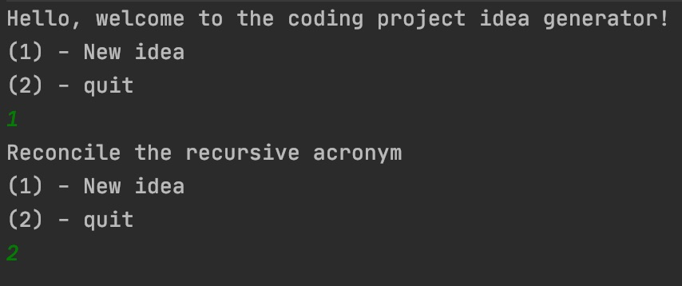

# Overview

This program will generate ideas for possible coding projects using a random combination of verbs and nouns, or choose from a list of projects from rosettacode.org.

# Development Environment
* IntelliJ IDEA
* Kotlin 1.4.9

# Execution

To execute the program: main.kt

# Useful Websites
These websites were used in part to make the lists used to generate ideas.
* http://rosettacode.org/wiki/Category:Programming_Tasks
* https://www.hackterms.com/about/all
* https://insights.dice.com/power-verbs-for-technical-work/
